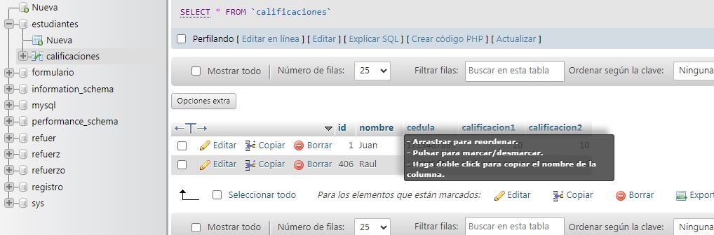
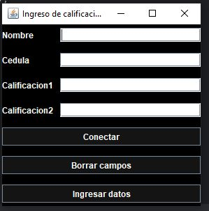
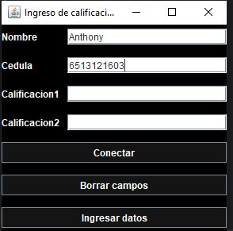
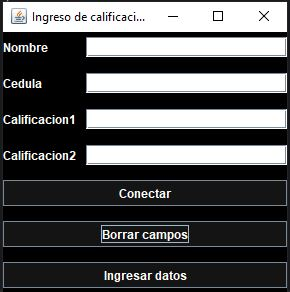
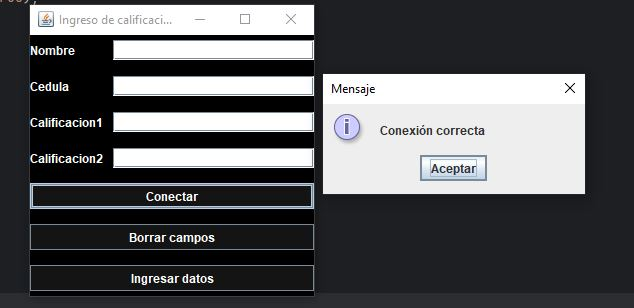
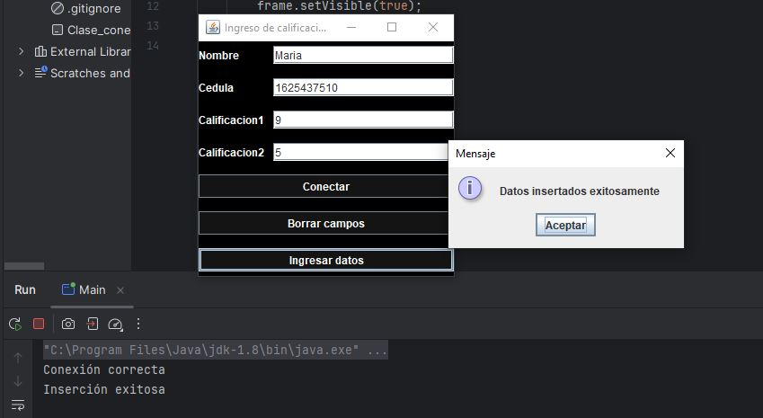
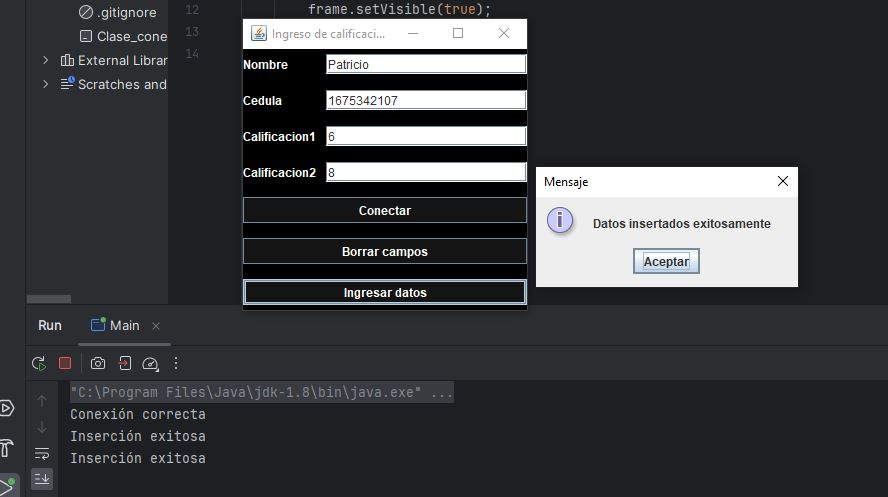
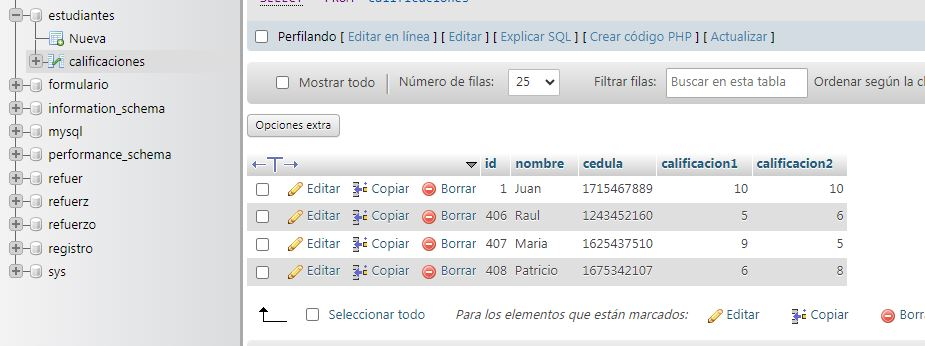

# Código con JDBC y Java Swing desde otra clase - Francisco Caero
Para empezar tenemos que crear la base de datos según las instrucciones, con el registero del script y uno más que fue ingresado durante las pruebas.
  
Ahora mostraré la primera pantalla que se verá al ejecutar el programa, nos presentará estos campos de texto y estos botones.
  
  
Lo siguiente que hice fue ver que me dejara ingresar datos, para posteriormente verificar los botones.
    
    
Si funciona correctamente al aplastar borrar, todos los campos deberían vaciarse, se puede ver que en efecto aplasté ese botón e inmediatamente todos los campos de texto quedaron en blanco.
    
  
    
Otra opción muy importante, es la de conectar si tenemos éxito en esto: podremos hacer el resto de acciones, sino tendremos que configurar correctamente antes de avanzar.
    

Si la conexión está configuarda correctamente, la repetimos en la opción para insertar nuevos datos y escribimos el script correctamente; y procedemos a hacer la prueba, se espera que salga el mensaje de aceptación y no la excepción.
  
  

El programa dice que no hay problema y que todo ha sido realizado debidamente: sin embargo, falta la prueba final, verificar si en nuestra base de datos sí se reflejan los cambios.
  
Efectivamente nuestro programa está funcionando y nos permite seguir ingresando nuevos estudiantes al sistema desde nuestro JFrame.
¡NOTA!: En la conexión de base de datos se usó una contraseña de acuerdo a mi configuración, en otros equipos seguramente necesite modificar para su uso.
